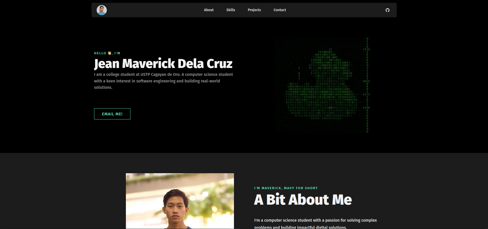

# ePortfolio



## Description
This is my personal ePortfolio, designed to showcase my skills, projects, and contact details. The portfolio is built using HTML and CSS to provide a clean, professional, and responsive design. It aims to give visitors an overview of who I am, the projects I've worked on, and how they can contact me. The portfolio will be further enhanced with JavaScript to add interactivity and additional functionality in the future.

## Technologies Used
- **HTML** - Used for structuring the content and layout of the portfolio.
- **CSS** - Used for styling and designing the portfolio to be visually appealing and responsive.
  
## Instructions for Replication or Contribution

### Clone the repository
To clone the repository and view the project locally, use the following command:
```bash
git clone https://github.com/your-username/your-repository-name.git
